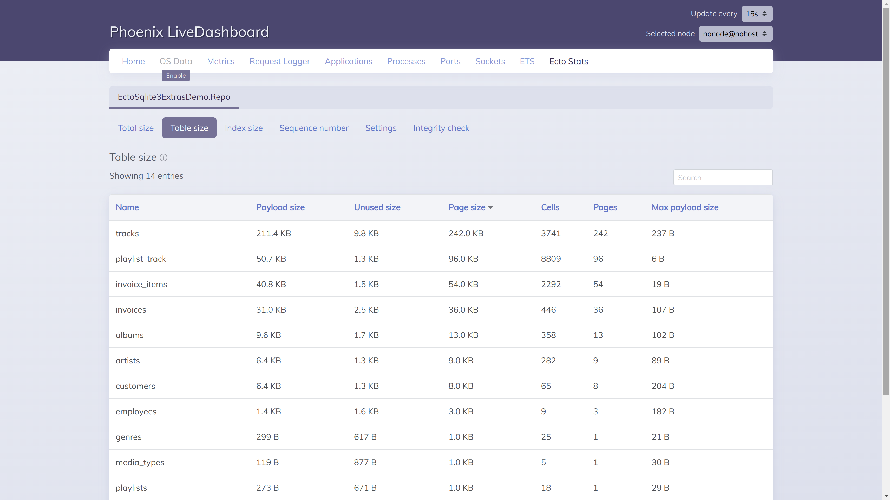
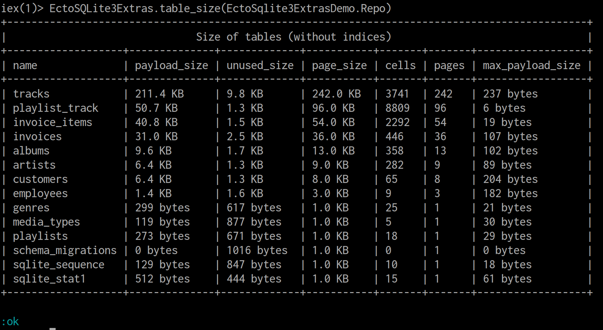

# Ecto SQLite3 Extras

Helpful queries and [Phoenix Live Dashboard](https://github.com/phoenixframework/phoenix_live_dashboard) integration for [SQLite](https://sqlite.org/index.html). It's like [ecto_psql_extras](https://github.com/pawurb/ecto_psql_extras) but for SQLite instead of PostgreSQL.

## Installation

The package can be installed by adding `ecto_sqlite3_extras` to your list of dependencies in `mix.exs`:

```elixir
def deps do
  [
    {:ecto_sqlite3_extras, "~> 1.1.5"}
  ]
end
```

## Integrating with Phoenix Live Dashboard

**WARNING:** [The integration is not merged upstream yet](https://github.com/phoenixframework/phoenix_live_dashboard/pull/400).

When you have `ecto_sqlite3_extras` in the list of dependencies for your [Phoenix](https://www.phoenixframework.org/) project that uses [ecto_sqlite3](https://github.com/elixir-sqlite/ecto_sqlite3), the [Phoenix Live Dashboard](https://github.com/phoenixframework/phoenix_live_dashboard) will automatically show the tables produced by `ecto_sqlite3_extras` in the "Ecto Stats" tab. Magic!



## Using from Elixir

If you don't have Phoenix Live Dashboard on the environment you want to inspect, you can use `ecto_sqlite3_extras` directly from the [iex](https://hexdocs.pm/iex/1.14/IEx.html) shell.

```elixir
# run the query and print a nice ASCII table into stdout
EctoSQLite3Extras.table_size(MyProject.Repo)

# get the raw output of the query
EctoSQLite3Extras.table_size(MyProject.Repo, format: :raw)

# run the query on a remote node
EctoSQLite3Extras.table_size({MyProject.Repo, self()})
```



## Available queries

1. `total_size`. The total size of all tables and indices. It's a summary table, it has only 2 columns: `name` and `value`. Rows:
    1. `cells`: The number of cells in the DB. Each value stored in the DB is represented as at least one cell. So, the number of cells correlates with the number of records in the DB.
    1. `payload_size`: How much space the actual useful payload takes in the DB.
    1. `unused_size`: How much space in the DB is reserved, not used yet, and can be used later to store more data. This is a surplus that occurs because SQLite allocates space for data in chunks ("pages").
    1. `vacuum_size`: How much space is unused and cannot be used for future data. You can run [VACUUM](https://www.sqlite.org/lang_vacuum.html) command to reduce it.
    1. `page_size`: The total space occupied by all pages. Each page is a single chunk of space allocated by SQLite. This number is the sum of `payload_size`, `unused_size`, and `vacuum_size`.
    1. `pages`: The total number of pages.
    1. `pages: leaf`: The pages that store the actual data. Read [SQLite Internals: Pages & B-trees](https://fly.io/blog/sqlite-internals-btree/) to learn more.
    1. `pages: internal`: The pages that store ranges for leaf pages for a faster lookup. Sometimes also called "interior pages".
    1. `pages: overflow`: The pages that store chunks of big data that don't fit in a single leaf page.
    1. `pages: table`: The pages used for storing data for tables.
    1. `pages: index`: The pages used for storing indices.
1. `table_size`. Information about the space used (and unused) by all tables. Based on the [dbstat](https://www.sqlite.org/dbstat.html) virtual table.
    1. `name`: The table name.
    1. `payload_size`.
    1. `unused_size`.
    1. `vacuum_size`.
    1. `page_size`.
    1. `cells`.
    1. `pages`.
    1. `max_payload_size`: The size of the biggest payload in the table.
1. `index_size`. Size of all indices.
    1. `name`: The index name.
    1. `table_name`: The table where the index is defined.
    1. `column_name`: The name of the column being indexed. This column is NULL if the column is the rowid or an expression.
    1. `payload_size`.
    1. `unused_size`.
    1. `page_size`.
    1. `cells`.
    1. `pages`.
    1. `max_payload_size`.
1. `sequence_number`. Sequence numbers of autoincrement columns. Generated based on the [sqlite_sequence](https://renenyffenegger.ch/notes/development/databases/SQLite/internals/schema-objects/sqlite_sequence) table. The query will fail if there are no autoincrement columns in the DB yet.
    1. `table_name`.
    1. `sequence_number`.
1. `pragma`. List values of PRAGMAs (settings). Only includes the ones that have an integer or a boolean value. For brevity, the ones with the `0` (`false`) value are excluded from the output (based on the observation that this is the default value for most of the PRAGMAs). Check out the SQLite documentation to learn more about what each PRAGMA means: [PRAGMA Statements](https://www.sqlite.org/pragma.html).
    1. `name`: the name of the PRAGMA as listed in the SQLite documentation.
    1. `value`: the value of the PRAGMA. The `true` value is converted into `1` (and `false` is simply excluded).
1. `compile_options`. List the [compile-time options](https://www.sqlite.org/compile.html) used when building SQLite, one option per row. The "SQLITE_" prefix is omitted from the returned option names. See [exqlite docs](https://github.com/elixir-sqlite/exqlite#defining-extra-compile-flags) on how to change these options.
1. `integrity_check`. Run integrity checks on the database. Executes [PRAGMA integrity_check](https://www.sqlite.org/pragma.html#pragma_integrity_check) and returns the resulting messages.

## Acknowledgments

These are the projects that made `ecto_sqlite3_extras` possible:

1. [phoenix_live_dashboard](https://github.com/phoenixframework/phoenix_live_dashboard) is the reason why I made the project. I want my SQLite-powered Phoenix service to have the same nice-looking live dashboard as for PostgreSQL.
1. [exqlite](https://github.com/elixir-sqlite/exqlite) provides SQLite support for Elixir. They [enabled just for me](https://github.com/elixir-sqlite/exqlite/issues/231) the `SQLITE_ENABLE_DBSTAT_VTAB` option required for `ecto_sqlite3_extras` to work, literally making this project possible.
1. [ecto_psql_extras](https://github.com/pawurb/ecto_psql_extras) is a similar project for PostgreSQL. I shamelessly copied the project structure and tests, so that I can be sure that `ecto_sqlite3_extras` can be a drop-in replacement for `ecto_psql_extras`.
